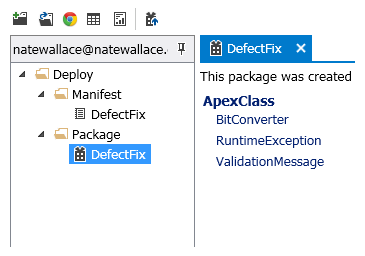

# Project Description
Walli is an open source SalesForce integrated developer environment(IDE) application written in .NET.

Walli is a stand alone IDE that takes a lot of inspiration from the Microsoft Visual Studio IDE.  Using Walli is similar to the Developer Console in that you view and make changes to your code directly in your org.  This differs from the Eclipse plugin where code is stored locally and requires you manually keep changes in sync between your desktop and org.  Below are some other features you will find in Walli.

# Features
----

## Code Completion

A must have for any IDE.  As you type in an Apex or VisualForce document, Walli will prompt you with possible text to complete your input.  Code completion will make your life easier by having a complete reference to your code base with a single key stroke.

## Code Folding

Using the //region and //endregion keywords, you can setup sections of your code that can be folded.  This is a useful feature for keeping your code well organized and easier to understand.

## Unit Tests

Good unit tests make for good software. Walli allows you to quickly kick off a unit test and view the results. You can easily run the unit test for a test class you are working on or list all of the test classes in your organization and select the ones you want to run.

## Deployment Tools

There are a number of tools that help you with your deployments.  You can easily setup manifests and packages and then deploy those packages all from within Walli.  Or, if you prefer you can take the manifests and packages you've created in Walli and use them with other deployment tools such as the SalesForce ANT based deployment tool.

## Data Tool

The data tool is a flexible tool that allows you to query the data in your organization.  In addition to displaying the data from your queries in a data grid, you can easily make changes to that data within the same grid and commit those changes back into your organization.

## Log Viewer

The log viewer enables you to easily turn on debug logging and view the resulting data.  In addition to displaying logs in familiar plain text you can also view them in a tree view that shows a more structured picture of what's going on in the system.  With this enhanced view it becomes more easy to trace the path of execution through your system and quickly narrow in on whatever issue you are trying to resolve.

----