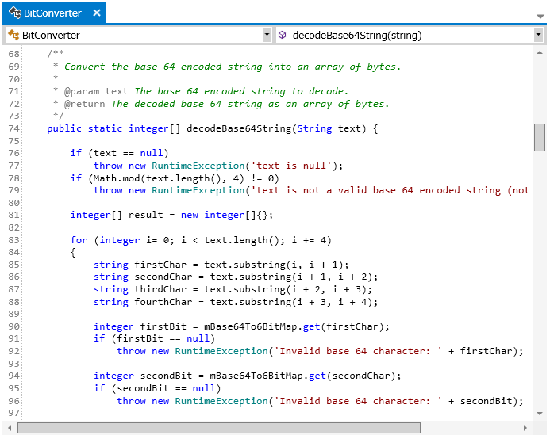

## Class and trigger editor

### Class editor

The class editor is a document that is opened when you double click on a class item found under the _/Source/ApexClass/_ folder within the navigation view.  Every time you open the class editor, the most recent version of the classes text is loaded into the editor.  The one exception to this is if there is already a class editor open in the documents area for the class you double clicked on.  When this happens that document will be made active instead of a new document being opened.

#### Saving

After making a change to the text in a class editor you can save those changes back to the SalesForce instance.  When working with classes, the text is never stored locally.  As noted above, when you open a class it is always loaded from the SalesForce instance.  Whenever you save a class it is always saved back to the SalesForce instance.  To save changes, type Ctrl+S or click _DOCUMENT | Save <document>_ from the main menu where <document> is the name of the currently active document.

When you attempt to save changes to a class Walli will first check to see if any changes have been made to that class since you last retrieved the class text from the SalesForce instance.  If any changes were made you will be given a warning message notifying you that you may overwrite someone else's changes if you continue with the save.  You will then have the option of going forward with the overwrite (and possibly making a new enemy) or canceling the save.

#### Syntax and error highlighting

The class editor will highlight text based on the apex syntax.  Things like strings, keywords, and comments will all be highlighted a different color to make editing and analysis easier.

Parsing errors will be underlined with a wavy red line.  Note that the presence of an error highlight doesn't necessarily mean the syntax is incorrect and will not prevent you from saving.  Although every effort was made to create a local parsing engine that is consistent with the apex language rules, the accuracy of this can't be guaranteed since there is no public formal grammar definition for apex that I could find.  The parser was created using what documentation I could find as well as analyzing the behavior of the SalesForce parsing rules.

#### Code Completion
As you type you will be prompted with possible text values to complete what you are typing.  This feature is context aware.  As an example if you type a dot after a local variable the members defined for that variable type will be displayed and you can select the desired value.

The first time you open a project Walli will download symbols for all of the classes and objects in your organization and cache them locally.  You will know this is happening because a message will appear in the lower left side of the application stating that symbols are being downloaded.  As you open files and make changes to them the local cache of symbols will be updated for those files.  However, since your organization may have many changes across many files, you may want to refresh the entire cache from time to time instead of having to open each file individually to get the latest symbols.  You can do this by clicking the Project | Reload Symbols menu item in the main menu.  This will delete all of the symbols in your local cache and download all new symbols from your organization.

#### Code Folding
You can setup sections of your code that can easily be toggled between being hidden and visible with the click of a button.  This is called code folding.  To setup a folding section you simply need to add two lines of code.  The first line will mark the beginning of the section of code you want to fold and will start with the _//region_ keyword and can then be followed by optional text on the same line that will still be displayed even when the section is folded.  The second line of text marks the end of the section you want to fold and uses the _//endregion_ keyword.  

When these two lines are present, a minus sign will appear next to the _//region_ keyword that, when clicked, lets you hide all of the text between it and the _//endregion_ keyword.  Once you hide a section, the plus sign will appear next to the _//region_ keyword that lets you make the section of text visible again.

In addition to clicking the plus and minus signs, you can use the _Collapse/Expand all unfolded/folded sections_ toggle menu item in the DOCUMENT menu.  This will toggle between making all defined folding sections either hidden or visible.

#### Member navigation

Found at the top of the class editor are two drop down menu controls.  The drop down menu on the left side will display all class and interfaces that are defined within the document.  The drop down menu on the right side will list all of the fields, constructors, properties and methods defined within the currently selected class or interface in the drop down menu on the left side.

When you select an item from the left or right side drop down menus the editor will navigate to and highlight text in the document where that item is defined.  When you move your cursor around the text document, these two drop down menus will be updated to reflect where your cursor is in the document.

#### Text search

You can perform searches within the current class editor document by pressing Ctrl-F while focus is in the class editor or by clicking _DOCUMENT | Find_ in the main menu.  This will open a text search panel in the top right side of the class editor.  Using this search panel you can perform simple, whole word, case sensitive, and regular expression searches.

### Trigger editor

The trigger editor is identical to the class editor as documented above with the exception of a few things.  

The trigger editor is opened the same way the class editor is opened except that it is opened when a trigger found under _/Source/ApexTriggers/_ in the navigation view is double clicked.

The trigger doesn't have any Member navigation controls as there are no members that would be navigated to.

**Next:** [VisualForce and Component editor](VisualForce-and-Component-editor)
 
 