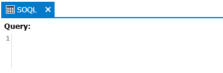
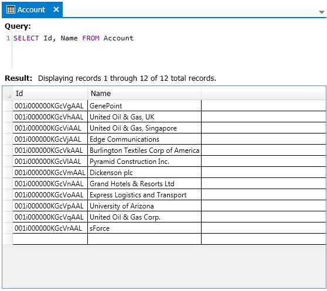
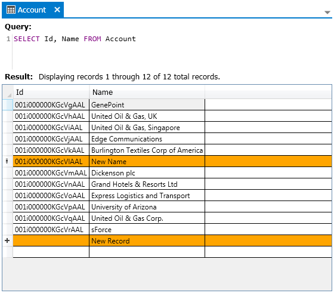

### Data query tool

The data query tool is used to both query SalesForce data and make changes to it.  To open the data query tool you can click the _PROJECT | Data query tool_ menu item or you can click the toolbar button that looks like a table with grid lines.  When either is clicked a new Data query tool document will be opened.  You can have multiple data query tools open at one time.

#### Query data

When the data query tool is first presented it will have a generic name of SOQL in the tab and the only control within the document that will except input is the Query text editor.  To view some data, enter a valid SOQL query and then click the _DOCUMENT | Execute_ menu item in the main menu or the same button in the toolbar.  You can create a query by entering the text manually or you can drag and drop objects and fields from items in the navigation view under the Data tab.

After clicking Execute, the query is sent to the SalesForce instance and the resulting data is returned and displayed below the query in a table.  The tab for the document will also be updated to display the name of the object that was queried.

#### Modify data

After retrieving the data you can make changes to it directly in the results table and then commit those changes back to SalesForce by clicking the _DOCUMENT | Commit_ menu item found in the main menu or by clicking the same button in the toolbar.  Note that in order to commit an update to an existing record you need to include the Id field in the initial query that brought back the data you are now editing.

#### Export data

You can also export data from a query that you have executed.  After a query has been executed you can click the _DOCUMENT | Export data results_ menu item from the main menu or click the same button in the toolbar.  If there are more results that are not displayed yet in the view then you will be asked if you want to export just the currently displayed results or if you want to export the currently displayed results as well as any additional results that have not been displayed yet.  You will also be prompted for the name of the file that the results will be exported to.  Once you have entered a file name then the results will be exported into that file as a CSV formatted data set.

**Next:** [Class and trigger editor](Class-and-trigger-editor)
 
 