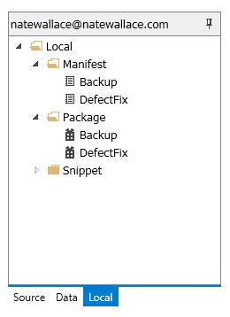
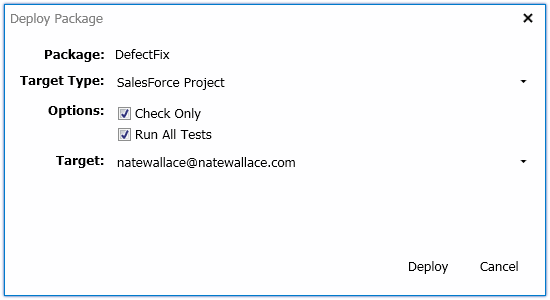
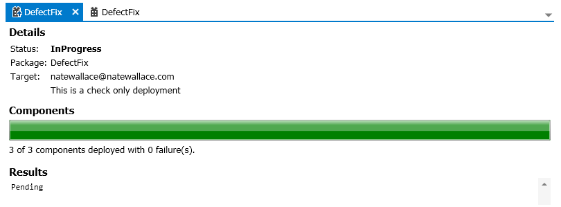

### Deployment Tools

There are several deployment tools that help you manage your deployment activities.  The tools revolve around the following two deployment items: Manifests and Packages.

#### Manifests

>

In order to deploy components from one instance to another instance you need to list out the components that are to be moved in a file known as a manifest.  In Walli you can create and populate a manifest in several ways.  No matter how you create a manifest they will all be stored in the Manifests folder which can be found by clicking on the Local tab in the navigation view and expanding the root node there.  Walli uses the same format as the SalesForce ANT based deployment tools with manifests so it's easy to create and work with manifests between both Walli and SalesForce ANT as well as any other tool that uses this same format. 

* Manual creation.  The easiest way to create a manifest is to create a new empty manifest by either clicking the _PROJECT | New... | New manifest..._ menu item in the main menu or by right clicking on the Manifest folder in the navigation view and selecting the _New manifest..._ menu item.  When you click either of these menu items you will be prompted for a name to give the manifest.  Keep in mind that the name needs to be unique among all of the rest of your manifests.

* Import an external manifest.  You may have already created a manifest outside of Walli but you'd like to import it to use within Walli.  This is done by simply dragging your manifest or manifests from your local folder and dropping them onto the Manifest folder within the Local tab of the navigation view.  The manifest(s) will be copied into Walli.  If there are any duplicate names then the newly imported manifests will be renamed with a number appended to the original name to insure that each name is unique.  For example _MyComponents(1)_.

* Creating manifests from a report.  After you have created a report you select items from within the report and export them into a new manifest or optionally export them to an existing manifest.  See the documentation for [Reports](Reports) on how to create a report.

Now that you've created a manifest in Walli you can edit it as necessary.  Again there are several ways to edit a manifest in Walli which are detailed below.

* Select components from the Source tab in the navigation view.  Before you make edits using the Source tab you will need to open the manifest in the content view which is done by double clicking the desired manifest in the Local tab navigation view.  Note that if you have just created a manifest it has already been opened for you.  Once the manifest is open you can click the Source tab in the navigation view to display the components that exist in your org.  To add a component to the manifest you simply need to drag the component found on the Source tab into the open manifest in the content view.  You can also select multiple components at once and then drag and drop those all at once.  You don't need to worry about duplicates either as Walli will make sure each component is only listed once.

* Manually add components.  With the manifest open in the content view you can make a manual entry in the manifest. This is sometimes necessary as not all components are exposed through the SalesForce API so Walli can't display those items in the Source tab of the navigation view.  To add a manual entry you can either click the _DOCUMENT | Add manual entry..._ menu item from the main menu or click the same item found in the main toolbar.  You will be prompted for the category and name of the component to add with a forward slash(/) separating the two.  For example if you wanted to include the standard Name field on the Account object in a deployment you would create a manual entry with the value _CustomField/Account.Name_.  

* Merge manifests.  In Walli you can easily merge the components from one manifest into another.  A merge is initiated when you either click the _PROJECT | Merge manifests..._ menu item from the main menu, right click on a manifest in the Local tab navigation view and select the _Merge manifests..._ menu item, or when you drag a manifest file from the Manifest folder on the Local tab navigation view and drop it onto an open manifest in the content view.  If you click one of the _Merge manifests..._ menu items you will be prompted for the manifests that will be the source and target in your merge.  If you do the drag and drop you will be prompted to confirm that you want to merge the source manifest you dragged into the target manifest that you drop it on.

#### Packages

Once you are done creating and editing your manifests you are ready to move on to the next step which is to create deployment packages.  A package contains all of the actual components that you wish to deploy from one instance to another instance.  They are created from the list of components found in a manifest.  Again, Walli uses a standard format for the definition of a package so packages within Walli can also be used with other tools such as the SalesForce ANT deployment tools.

As was mentioned earlier the manifests are in a standard format so you can take the manifests you have created in Walli and export them to use with other tools to create your packages if you wish.  To export a manifest from Walli you simply need to find the manifest you want to export in the Local tab of the navigation view and drag and drop it onto a local folder.  When you do this a copy of the manifest is made and exported to the folder you dropped it on.  Note that you can also select multiple manifests when exporting with a drag and drop.

If you want to create a package within Walli, that is easy too.  Packages are always created within Walli using manifests that are found within the Local tab of the navigation view.  You first need to open the manifest you want to create a package from so it is displayed in the content view.  If you have unsaved changes to the manifest you will need to save those changes before creating a package.  To create a package you click either the _DOCUMENT | New package..._ menu item in the main menu or the same item in the main toolbar.  You will then be prompted for a name to give the package that will be created.  You will also have the option to make the package destructive by clicking the corresponding check box.  A destructive package is used when you want to delete components instead of deploy them.  Once you click on the Create button, all of the components you have listed in the manifest will be downloaded from the current instance your project is connected to and saved into the new package.

After you have created a package it will show up in the Package folder found in the Local tab navigation view.  You can also import packages created outside of Walli by doing a drag and drop the same way you would with an external manifest but you would target the Package folder for the drop instead of the Manifest folder.

For the final step you can now deploy your package.  To deploy a package you must first open it in the content view by double clicking the package in the Local tab navigation view that you want to deploy.  Note that if you have just created a new package it will be opened for you in the content view automatically.  To deploy the package you will click the _DOCUMENT | Deploy package..._ menu item from the main menu or the same item found in the main toolbar.  This will bring up a prompt that will require you to enter a few things.

* Check Only.  Check this check box if you don't want to actually deploy your package but would like to test that the deployment will work.
* Run All Tests.  Check this check box if you want to run all of the unit tests in the instance when you deploy your package.  Not that if any of the unit tests fail when this check box is checked your package will not be deployed.
* Target.  This is where you will deploy your package to.  You can choose from any project you have defined on your system.  If you don't see the target you would like to deploy to you will have to create a new project that points to the instance you want to deploy the package to.

Once you have entered the required information and clicked the Deploy button your package will be deployed as configured.  A new document is opened in the content view that will display the progress of your package deployment and will eventually indicate if it succeeded or failed.

**Next:** [Team](Team)
 
 
