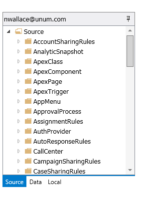
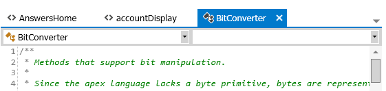

## Navigation

When you open a project a new control will become visible on the left side of the screen.  This control is the navigation view and it allows you to explore and navigate the items in the SalesForce instance.  
<
The navigation view has a title bar which displays the name of the credential for the project that is currently open.  In the title bar there is also a button with a pin icon.  When this button is clicked it will collapse the navigation view to the left giving more space to the documents area of the application.  By clicking the button again it will expand the navigation view back to its original width.

The navigation view contains 3 different tabs which are labeled Source, Data and Local.

The Source tab displays all of the metadata that is defined within the SalesForce instance you are connected to.  Every time you open a project and expand the Source folder found in the Source tab, the most recent metadata will be downloaded and displayed.

The Data tab is similar to the Source tab except that it displays definitions for the various data objects that exist in your SalesForce instance.

Lastly the Local tab shows items that are stored locally on your machine.  Things like manifests, packages, and snippets that you have created will be displayed within this tab.

Items in each tab are sorted into folders and sub-folders based on what type of items they are.  To make the application perform efficiently, most items found in a folder are not retrieved until you expand the folder that contains them.  When you expand a folder and see a waiting icon, the application is retrieving the items at that time.  After the items have been retrieved they are displayed in the folder and no further retrieval of items will be done for that folder unless the user right clicks on it and then clicks on the _Refresh_ menu item which will retrieve the latest items from the SalesForce instance.
----
Most of the items that appear in the navigation view can have functions performed on them based on what type of item they are.  Functions are performed on navigation items in one of a number of ways.

* Right click on a navigation item and then click on a menu item in the pop-up menu that is presented.
* Select a navigation item and then click on a menu item from the main menu.
* Double click on a navigation item.
* Drag and drop a navigation item.

## Documents

Most of the work you will do in Walli will be through the viewing and editing of various documents.  Documents are displayed in the area to the right of the navigation view.

Documents can be opened by performing functions on items found in the navigation view or by executing functions that aren't associated with a SalesForce item.  

Multiple documents can be open at the same time.  Each open document gets its own tab in the documents area allowing you to navigate between each open document by selecting the tab for the document you want.  

In addition to the tabs there is also an overflow button in the top right of the documents area that looks like an arrow pointing down.  When you click on this button a menu which lists all of the open documents will be shown allowing you to select a document whose tab may not be visible if there are too many documents open.

**Next:** [Data query tool](Data-query-tool)
 
 