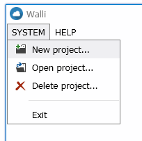
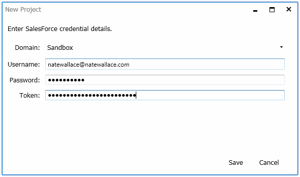
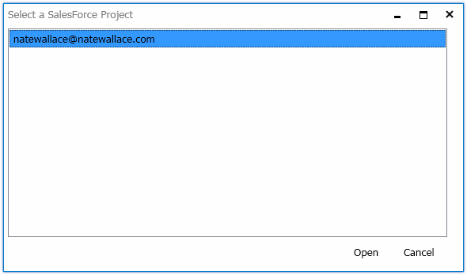

## Project management

### Creating a new project

When you start Walli for the first time you will be presented with a blank screen and only a handful of functions that can be performed.  The first thing you will want to do is create a new project.  Projects in Walli are created and stored on the local machine and are associated with a specific SalesForce instance.  To create a project click the _SYSTEM | New project..._ menu item or click the first toolbar button which is an image of a folder with a plus sign.

When you click either the menu item or the toolbar button you will be presented with a new dialog that will prompt you for your SalesForce credentials.  The credentials you enter will be used to log into the SalesForce instance that your credentials point to.  They will also be used to uniquely identify the project you are creating.  In Walli you can only create one project per unique SalesForce credential.  This is meant to keep project management simplified.

After entering all of your credential details and clicking the _Save_ button the project will be created and automatically opened and you can start viewing and making changes to the SalesForce instance that is associated with the project.

### Closing a project

Now that you have created a new project and it has been opened you will want to know how to close the project when you are done with it.  There are a number of ways to do this.  The most straight forward way to close a project is to click the _SYSTEM | Close project..._ menu item.  This will close the currently open project and return you to the state the application was in when you first launched it.  Another way to close the currently open project is to open a different project.  When this happens the currently open project will be closed before the other project is opened as you can only have one project open at a time.  Lastly you can close the currently open project by closing the entire application.  When an application is being closed the currently open project will be closed automatically before the application exits.

### Opening a project

To open a project you will need to click either the _SYSTEM | Open project..._ menu item or the second toolbar button which is an image of an open folder with an arrow.  When you click either the menu item or the button you will presented with a new dialog that asks you which project you want to open.  This dialog will list all of the projects you have created on your local machine previously.  When you double click the desired project in the list or single click it and then click the _Open_ button, that project will be opened.

### Deleting a project

The last step in project management is project deletion.  When you are done with a project and no longer want it on your local machine you can delete it.  Note that when you delete a local project it can't be undone.  To delete a project, click the _SYSTEM | Delete project..._ menu item.  This will present a dialog similar to the Open project dialog however when you select a project by double clicking or single clicking a project and then click the _Delete_ button you are selecting the project that will be deleted.  When you do this you will get a message box asking you to confirm that you actually want to delete the project.  By clicking yes, the project will be removed from your local machine.

**Next:** [Project layout](Project-layout)
 
 