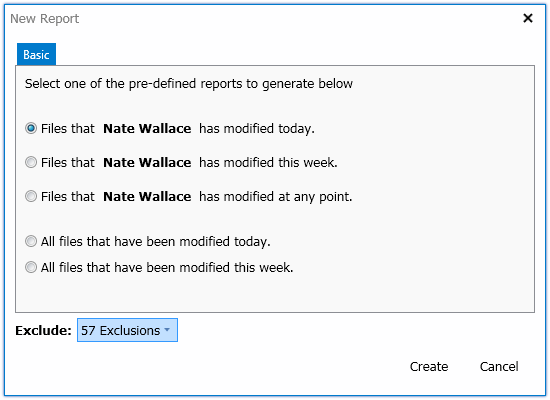
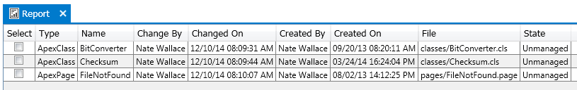

### Reports

In Walli you can generate a few basic reports that let you see who has been making changes to components and when those changes have been made.  This can be useful when creating deployments as well as keeping track of development activity in a SalesForce instance.  It should be noted that not all changes that have occurred will show up in a report.  Walli is limited to the information that the SalesForce API exposes when creating these reports and SalesForce does not expose all information through the API.  For example, if a change is made to a standard field such as the Name field on Account, then this change will not show up on the report since it is not exposed in the SalesForce API.

#### Creating the report

To create a report you first need to click the _DOCUMENT | New report..._ menu item in the main menu.  This will open a new dialog that lets you specify the criteria for the report that will be generated.

You can select from 5 predefined report filters.  The first three filters in the list allow you to select a user to filter by.  By default you are the user that will be listed in the filter.  You can change this by clicking on the user name in the filter and selecting a different user to filter on if you wish.

In addition you can also specify component types to exclude from your report.  To do this you simply need to open the menu next to the Exclusion label and then select any component types that should be excluded from the report that gets generated.  Also note that the more component types that you excluded from the report generation the faster the report will be created since each component type not excluded needs to be queried for changes.

Once you have selected your report criteria and clicked the Create button your report will be generated and displayed in a new document within the documents view.

#### Working with reports

Each component that meets your report criteria will be displayed in a single row on the report along with several other properties such as the name of the person who last modified the component and the time it was last modified.

With the components listed you can select them by clicking the check boxes on the left side of the table and then create or merge into deployment manifests with the selected components.  This is done by first checking the desired components and then clicking the _DOCUMENT | New manifest from selected report items..._ or the _DOCUMENT | Merge selected report items into manifest..._ from the main menu or by clicking the same buttons on the toolbar.

See the [Deployment Tools](Deployment-Tools) page for more information on manifests and how they are used in deployments.

**Next:** [Deployment Tools](Deployment-Tools)
 
 