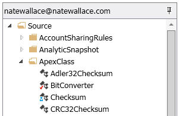

### Team

Walli has a number of features and tools that will help teams of developers coordinate their work when working in a shared environment.  These features and tools revolve around the management of source code in your sandbox.

#### Configure

All of the team features and tools are optional and therefore need to be enabled in each sandbox if they are to be used.  This is done with the Source control configuration dialog.  To open this dialog, first open the project that you want to configure team settings for.  Once the project is open, in the main menu click the _PROJECT | Team | Configure source control..._ menu item.  You will see a dialog that looks like the following below.

As you can see there is a button at the top of the dialog which states "Click here to enable the checkout system."  When you click this button you will enable the check out system for all Walli users in the sandbox as well as be given the option to configure Git source control options.  The Git source control options are discussed later in this document but first the check out system is covered in detail in the next section.

#### Check outs

The check out system is a Walli feature that, when enabled, allows you to mark particular files in a sandbox as being checked out by you.  When a file is checked out, it prevents other Walli users from making any changes to those files until you check them back in.  

You can check out a file by right clicking on the desired file in the Source tab and then selecting the _Check out file_ menu option.  You can also do so from the _PROJECT | Team_ menu when the file or files desired are currently selected in the Source tab.  Once the file has successfully been checked out you will see a check mark icon appear next to the file in the Source tab view as can be seen on the BitConverter file in the image below.

If another user has a file checked out then you will see a blue person icon appear next to the file the other user has checked out.  This is shown on the Checksum file in the image below.  To find out who has the file checked out you can right click on the file and click the _View (file name) properties..._ menu item.  

It should be noted that when a user checks out a file it will not be known to other Walli users right away.  The check out status of a file is only updated when you refresh the folder a file is in, refresh a file, or you open a file.  Because the check out status of a file may be out of sync at any time, you may receive an error message when trying to save changes to a file because that file is currently checked out by another user.  Because of this, it is a good practice to first check out the file you wish to modify before you make any modifications to ensure that you are the only person who can make changes to the file at that time.

When you are done making your changes and are ready to free up a file so that others can modify it you will need to check in that file.  To do this you can right click on the file you have checked out in the Source tab and click the _Check in file..._ menu item.  This will present you with a dialog that lists all of the files you currently have checked out.  Make sure the file or files you want to check in are selected and then click the Commit button.

You should be aware that the check out system only works when all of the developers on a team are using Walli.  There is nothing that will prevent a developer from using another tool such as Eclipse or the Developer Console and making changes to a file that you have checked out in Walli.

The way the check out system works in Walli is that a SalesForce Object called {"Walli_Lock_Table__c"} is created in a sandbox when the checkout system is enabled.  The presence of this object will signal Walli clients to enforce check out rules for each Wall user.  You can also directly edit records on this table if you wish to effect what is checked out and by whom.  This can be useful if a developer has checked out a file and then goes away for a two week vacation.  In this scenario you can simply go in and delete all the records that have the developers name in the {"User_Name__c"} field which will check in those files.

#### Source control

In addition to the check out system, Walli has limited support for source control using Git.  The source control feature is built on top of the check out system so you will need to have it enabled in order to use source control in Walli.  When you have enabled the check out system you will see new configuration options in the Source control configuration dialog as shown below.

The source control feature allows you to sync changes in your sandbox to a remote Git repository.  If you enter a Git repository url in the source control configuration dialog, Walli will push the latest version of a file to that repository and the specified branch using the specified credentials when you check it in.  It's that simple.

If you check out a file and decide you don't want to push it to the remote Git repository then you will need to undo your check out instead of doing a check in.  To undo a check out, simply select the _Undo file check out..._ menu item when you right click on a file in the Source tab that is currently checked out to you.  Keep in mind that when you undo a file check out, it will not replace the file in your sandbox with the file that is currently in the remote Git repository.  You will need to manually revert any changes you have made in this scenario.

In addition to pushing changes to a remote Git repository you can also view a limited history and do comparisons with files that are in the remote repository.  

To view the history for a specific file, you can right click on that file and click the _Show file history_ menu item.  This will open a new document that will list all of the commits that have been pushed for this file.  From within this document you can then select an individual commit to view that version of the file or you can select two commits and do a comparison between them.  You can also do a comparison of your current version of the file to the most recent version that is in your remote Git repository.  This is done by opening the file in Walli and then clicking the _DOCUMENT | Compare | Compare with latest version in source control_ menu item.  In addition to viewing individual file histories, you can view a recent history of the entire remote Git repository by right clicking the root level Source folder in the Source tab and clicking the _Show repository history_ menu item.  This will show a list of the most recent commits and the files that were committed.

Lastly, there is a Delete Local Repository button on the Source control configuration dialog that can be used if you are experiencing any problems pushing your changes to the remote Git repository.  This can come in handy if for some reason the local Git repository becomes corrupted.  When you delete the local repository it will be rebuilt the next time you check in a file.

**Home:** [Documentation](Documentation)
 
 

