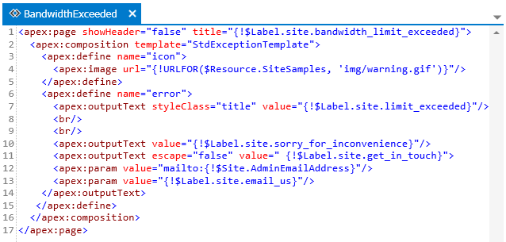

## VisualForce and Component editor

The visualforce and component editor is a document that is opened when you double click on any item found under the _/Source/ApexPage_ or _/Source/ApexComponent_ folders found in the Source tab navigation view.  Every time you open the editor, the most recent version of the items text is loaded into the editor.  The one exception to this is if there is already an editor open in the documents area for the item you double clicked on.  When this happens that document will be made active instead of a new document being opened.

### Saving

After making a change to the text in the editor you can save those changes back to the SalesForce instance.  When working with items, the text is never stored locally.  As noted above, when you open an item it is always loaded from the SalesForce instance.  Whenever you save an item it is always saved back to the SalesForce instance.  To save changes, type Ctrl+S or click _DOCUMENT | Save <document>_ from the main menu where <document> is the name of the currently active document.

When you attempt to save changes to an item Walli will first check to see if any changes have been made to that item since you last retrieved the item text from the SalesForce instance.  If any changes were made you will be given a warning message notifying you that you may overwrite someone else's changes if you continue with the save.  You will then have the option of going forward with the overwrite (and possibly making a new enemy) or canceling the save.

### Syntax highlighting

The editor will highlight text based on the html syntax.  Things like elements, attributes, and values will be highlighted to make editing and analysis easier.  Also note that Javascript will have its own syntax highlighting as well.

### Code Completion

Both VisualForce and HTML5 elements are supported in code completion.  Whenever you type a less than (<) character a list of possible elements will be presented.  Also, when you type a space while within an element tag you will be presented with possible attributes that are valid for the current element tag.

### Text search

You can perform searches within the current editor document by pressing Ctrl-F while focus is in the editor or by clicking _DOCUMENT | Find_ in the main menu.  This will open a text search panel in the top right side of the editor.  Using this search panel you can perform simple, whole word, case sensitive, and regular expression searches.

**Next:** [Reports](Reports)
 
 
